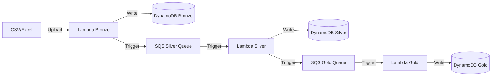

# ☁️ TecnoMundo ETL Pipeline - AWS Serverless

Pipeline ETL moderno y completamente serverless diseñado específicamente para **Tecno Mundo**.

Este sistema es el motor de procesamiento de datos que alimenta la futura **automatización de compras y stock** del negocio. Ingesta reportes de **ventas mensuales**, los procesa y estructura para permitir una reposición de inventario inteligente y automatizada.

Tecnologías clave: **AWS Lambda, DynamoDB y SQS**.


---

## 🏗️ Arquitectura Medallion (Serverless)

El proyecto implementa una arquitectura de capas (Bronce, Plata, Oro) utilizando servicios 100% gestionados y dentro del **Always Free Tier** de AWS.



### Componentes

1.  **Capa Bronce (Ingestión)**
    *   **Lambda**: `tecnomundo-bronze-ingestion`
    *   **Función**: Recibe datos crudos, sanea nombres de columnas y almacena tal cual.
    *   **Storage**: Tabla `tecnomundo_bronze_sales`.

2.  **Capa Plata (Transformación)**
    *   **Lambda**: `tecnomundo-silver-transformation`
    *   **Función**: Limpieza de datos, validación de tipos, eliminación de nulos.
    *   **Storage**: Tabla `tecnomundo_silver_sales`.

3.  **Capa Oro (Enriquecimiento)**
    *   **Lambda**: `tecnomundo-gold-enrichment`
    *   **Función**: Cruce con dimensiones de productos (Join) para agregar valor de negocio.
    *   **Storage**: Tabla `tecnomundo_gold_sales`.

---

## 📂 Estructura del Proyecto

```text
TecnoMundo_ETL_pipeline/
├── lambda_functions/          # Código fuente de las Lambdas
│   ├── bronze_ingestion/
│   ├── silver_transformation/
│   └── gold_enrichment/
│
├── src/tecno_etl/             # Código compartido y lógica de negocio
│   ├── extractors/            # Lectura de archivos (CSV/Excel)
│   ├── transformers/          # Lógica de limpieza y normalización
│   ├── validators/            # Esquemas Pydantic
│   └── pipelines/             # Scripts de orquestación local
│
├── conf/env/                  # Configuración de entorno
├── scripts/                   # Scripts auxiliares
└── tests/                     # Tests unitarios
```

---

## 🚀 Guía de Inicio Rápido

### 1. Requisitos Previos
*   Python 3.11+
*   Cuenta de AWS (Free Tier es suficiente)
*   Credenciales configuradas en `.env.aws`

### 2. Instalación
```bash
pip install -r requirements.txt
```

### 3. Configuración
Copia el template de entorno y agrega tus credenciales:
```bash
cp conf/env/.env.aws.example conf/env/.env.aws
# Editar conf/env/.env.aws con tus KEYS reales
```

### 4. Ejecución del Pipeline
Para probar el flujo completo desde tu máquina local (invocando la Lambda Bronze):

```bash
python src/tecno_etl/pipelines/invoke_aws_pipeline.py
```

### 5. Carga de Dimensiones (Productos)
Antes de ejecutar el pipeline de ventas, asegúrate de tener productos cargados:

```bash
python src/tecno_etl/pipelines/cargar_dimensiones.py
```

---

## 🛠️ Tecnologías

*   **AWS Lambda**: Cómputo serverless
*   **Amazon DynamoDB**: Base de datos NoSQL rápida y flexible
*   **Amazon SQS**: Desacoplamiento de procesos mediante colas
*   **Pandas**: Procesamiento de datos en memoria
*   **Pydantic**: Validación de esquemas y datos
*   **Boto3**: SDK de AWS para Python

---

## 💰 Optimización de Costos

Este proyecto está diseñado para funcionar eternamente **gratis** con volúmenes de datos moderados:
*   **Lambda**: 400,000 GB-segundos / mes (Gratis)
*   **DynamoDB**: 25 GB de almacenamiento (Gratis)
*   **SQS**: 1 millón de mensajes (Gratis)

---

## 👤 Autor

<div align="center">

<h3>Franco Aguilera</h3>
<p><strong>Data Engineer</strong> | Data Science @ Soy Henry</p>
<a href="https://www.linkedin.com/in/franco-aguilera-data-engineer/">

</a>
<a href="https://github.com/franco18min">

</a>
</div>

---